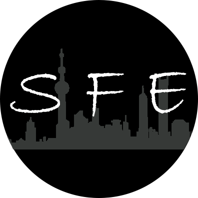

# SFE

SFE(Shanghai Front-End)源于百度前端技术学院所举办的IFE春季班组队环节。因成员都在上海工作而得名。我们致力于攻克IFE任务，精益求精。团队之间也互帮互助，共同进步。期望团队早日成为一支Super Front-End Team。

## 团队成员

* [@cnzsb](https://github.com/cnzsb/)（赵世博）

* [@eazyfire](https://github.com/eazyfire/)（岳强）

* [@eve0803](https://github.com/eve0803/)（郭丽敏）

* [@lilyzff](https://github.com/lilyzff/)（周芳芳）

* [@Taoqun](https://github.com/Taoqun/)（陶群）